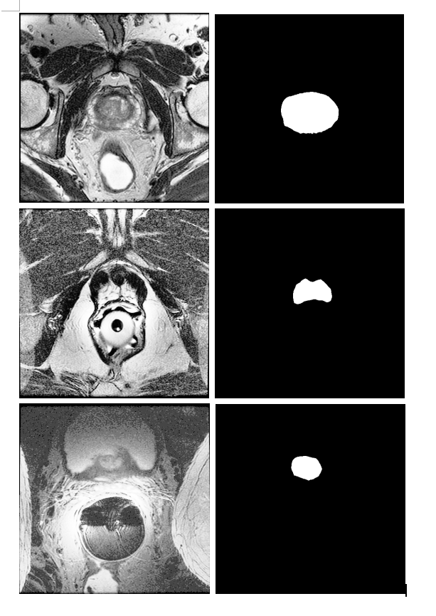

# ImageSegmentation With Vnet
> This is an example of the prostate in transversal T2-weighted MR images Segment from MICCAI Grand Challenge:Prostate MR Image Segmentation 2012

## How to Use

download trained data,download dataset：https://promise12.grand-challenge.org/download/

the file of PROMISE2012Image.csv,is like this format:
  D:\Data\PROMISE2012\Augmentation\Image/0_1.bmp
  D:\Data\PROMISE2012\Augmentation\Image/0_10.bmp
  D:\Data\PROMISE2012\Augmentation\Image/0_2.bmp
  ......
if you Augmentation trained data path is not D:\Data\PROMISE2012\,you should change the csv file path just like this:using C:\Data\ replace D:\Data\PROMISE2012\.

when data is prepared,just run the vnet_train_predict.py

training the model on the GTX1080,it take 20 hours,and i also attach the trained model in the project,you also just use the vnet_train_predict.py file to predict,and get the segmentation result.

download trained model:https://pan.baidu.com/s/19E9q6HIUeRB8jpuNhvE2Zg, passworld:obwu

## Result

the loss and model result，the example

## Contact
* https://github.com/junqiangchen
* email: 1207173174@qq.com
* WeChat Public number: 最新医学影像技术
